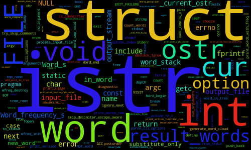

Domain Cloud
========================================================================

[![Travis CI status][travis_img]][travis_link]

[travis_img]: https://travis-ci.org/richteraj/domain_cloud.svg?branch=master
[travis_link]: https://travis-ci.org/richteraj/domain_cloud

Generate a word cloud from source files and show the domain as
expressed by the code.

The idea (which I encountered in a talk by Kevlin Henney): remove all comments
and string literals from the source files and feed the result into a tag cloud
generator.  When Looking at this word cloud it becomes obvious whether the
program is written in the language of the domain or not.

This C program executes the first step and calls the external Python program
[word_cloud](https://github.com/amueller/word_cloud) to generate the
picture.

The domain of this program is

...stream manipulation with curious `cur` and some options.

Prerequisites
------------------------------------------------------------------------

- a GNU compatible C standard library (i.e. the feature test macro
  `_GNU_SOURCE` is required)
- CMake (version 3.0 or newer)
- the above mentioned `word_cloud` (specifically the `wordcloud_cli.py` CLI
  wrapper) is installed, e.g. like

      pip3 install wordcloud --user

Installation
------------------------------------------------------------------------

Execute the following commands:

    ./configure
    make
    sudo make install

The project build is directed by CMake.  So the `configure` script simply
creates an empty `build` (or the name in the `BUILD_DIR` environment variable)
directory and calls `cmake ..` with `CMAKE_BUILD_TYPE=Release`.  It also
generates a Makefile which forwards the targets into the build dir.

To build directly with CMake use:

    mkdir build-dir
    cd build-dir
    cmake .. -DCMAKE_BUILD_TYPE=Release
    cmake --build .
    sudo cmake --build . --target install

Generate Doxygen documentation with `make doc` and run tests with `make test`.

Usage
------------------------------------------------------------------------

To generate a word cloud `project_wc.png` from the files `project.c` and
`project.h` call:

    domaincloud project.c project.h -o project_wc.png

To get further information call `domaincloud --help`.

________________________________________________________________________

Copyright 2017 A. Johannes RICHTER

Permission is granted to copy, distribute and/or modify this document
under the terms of the GNU Free Documentation License, Version 1.3
or any later version published by the Free Software Foundation;
with no Invariant Sections, no Front-Cover Texts, and no Back-Cover
Texts.  A copy of the license is included in the section entitled "GNU
Free Documentation License".
